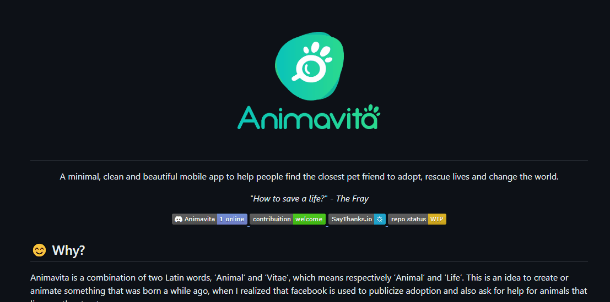

# Projeto com README 
Um projeto de teste com um arquivo README 🚀

[] 

## Tecnologias utilizadas

- HTML
- CSS
- JS

## Como utilizar 

1 - Clone projeto 
```
git clone
```

2 - Acesse a pasta do projeto 
```
cd repositorio-com-readme
```